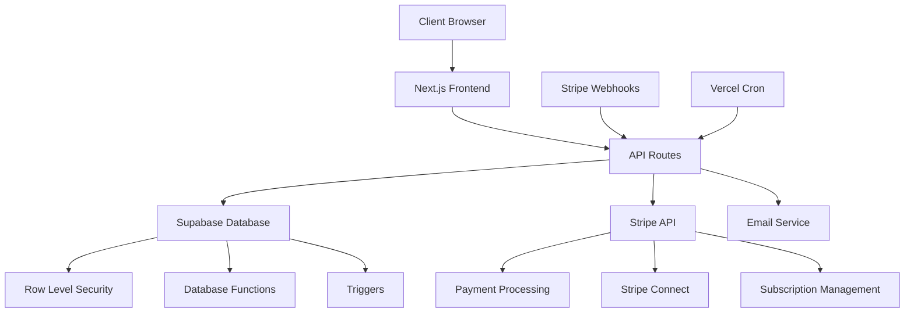
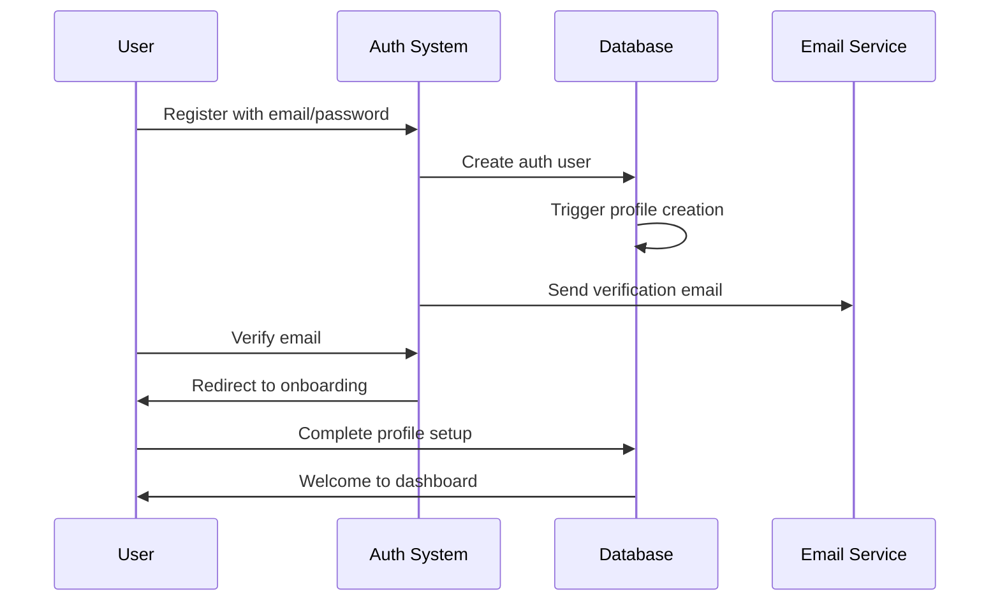
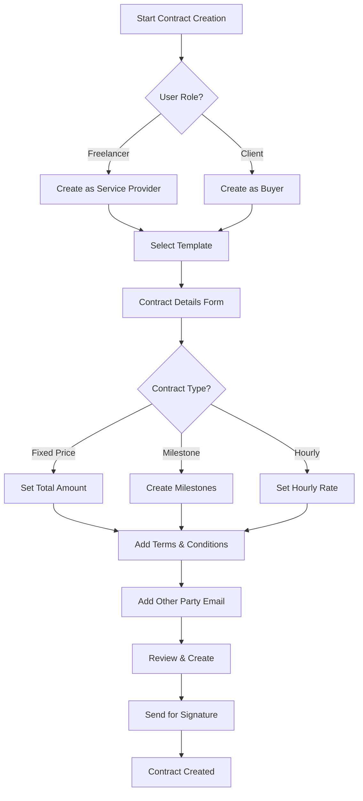
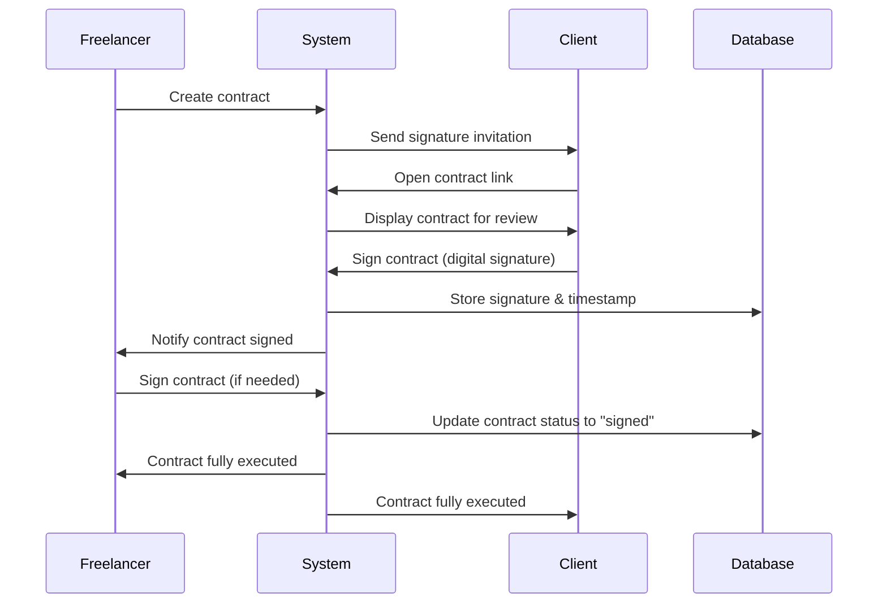
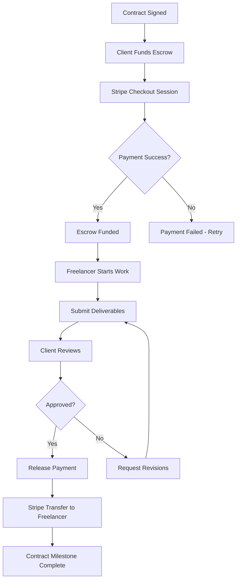
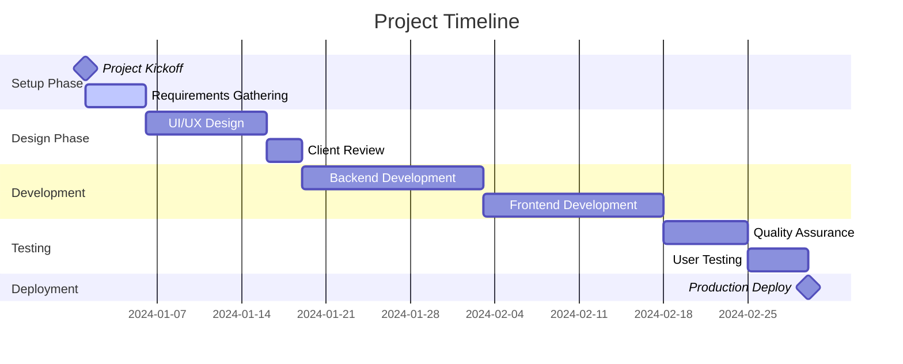
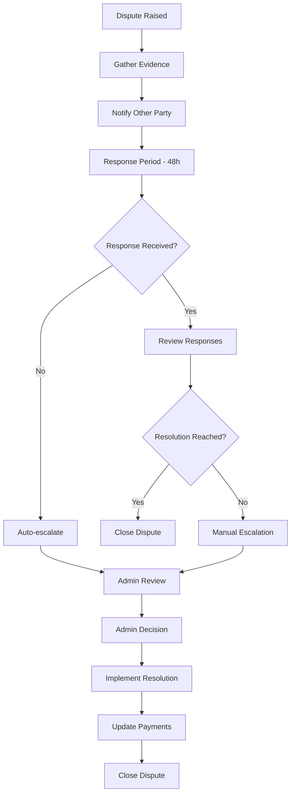
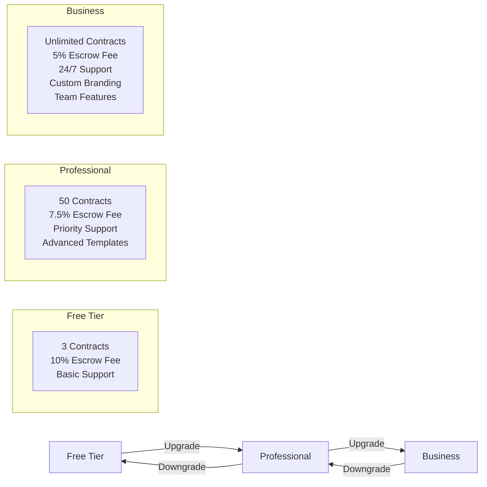

# Pactify Documentation

## 📋 Table of Contents

1. [Project Overview](#project-overview)
2. [Architecture](#architecture)
3. [Getting Started](#getting-started)
4. [User Workflows](#user-workflows)
5. [Technical Implementation](#technical-implementation)
6. [API Reference](#api-reference)
7. [Database Schema](#database-schema)
8. [Security](#security)
9. [Testing](#testing)
10. [Deployment](#deployment)
11. [Troubleshooting](#troubleshooting)

---

## 🎯 Project Overview

Pactify is a comprehensive **freelance contract management platform** that enables secure, legally binding contracts with integrated escrow payments. The platform serves both freelancers and clients, providing a complete solution for project management, payment processing, and dispute resolution.

### Key Features

- **Smart Contract Creation**: Wizard-driven contract builder with professional templates
- **Digital Signatures**: Legally binding electronic signatures with audit trails
- **Secure Escrow Payments**: Stripe-powered escrow system with platform fees
- **Milestone Management**: Project tracking with deliverable submissions
- **Dispute Resolution**: Structured mediation and resolution system
- **Real-time Collaboration**: Messaging, file sharing, and progress tracking
- **Multi-tier Subscriptions**: Free, Professional, and Business plans
- **Enterprise Security**: Comprehensive audit logging and compliance features

### Target Users

- **Freelancers**: Independent contractors, consultants, designers, developers
- **Clients**: Businesses, startups, agencies hiring freelance talent
- **Agencies**: Teams managing multiple client projects and freelancers

---

## 🏗️ Architecture

### Technology Stack

```
Frontend:
├── Next.js 14 (App Router)
├── React 19
├── TypeScript
├── Tailwind CSS
└── shadcn/ui

Backend:
├── Next.js API Routes
├── Supabase (PostgreSQL)
├── Supabase Auth
├── Stripe API
└── Nodemailer

Infrastructure:
├── Vercel (Hosting)
├── Supabase (Database & Auth)
├── Stripe (Payments)
└── Vercel Cron (Scheduled Tasks)
```

### System Architecture



### Data Flow

1. **User Authentication**: Supabase Auth → Profile Creation → Role Assignment
2. **Contract Creation**: Wizard → Database → Party Invitations → Signatures
3. **Payment Processing**: Stripe Checkout → Escrow → Release → Freelancer Payout
4. **Subscription Management**: Stripe Subscriptions → Webhooks → Database Updates
5. **Dispute Resolution**: Creation → Responses → Escalation → Resolution

---

## 🚀 Getting Started

### Prerequisites

- Node.js 18+ and npm
- Supabase account and project
- Stripe account (with Connect enabled)
- Email service credentials (SMTP)

### Installation

1. **Clone the repository**
   ```bash
   git clone https://github.com/your-org/pactify.git
   cd pactify
   ```

2. **Install dependencies**
   ```bash
   npm install
   ```

3. **Environment setup**
   ```bash
   cp .env.example .env.local
   ```

4. **Configure environment variables**
   ```env
   # Supabase
   NEXT_PUBLIC_SUPABASE_URL=your_supabase_url
   NEXT_PUBLIC_SUPABASE_ANON_KEY=your_supabase_anon_key
   SUPABASE_SERVICE_ROLE=your_service_role_key

   # Stripe
   NEXT_PUBLIC_STRIPE_PUBLISHABLE_KEY=pk_test_...
   STRIPE_SECRET_KEY=sk_test_...
   STRIPE_WEBHOOK_SECRET=whsec_...

   # Email
   SMTP_HOST=smtp.gmail.com
   SMTP_PORT=587
   SMTP_USER=your_email@domain.com
   SMTP_PASS=your_app_password

   # Security
   CRON_SECRET_TOKEN=your_cron_secret
   ```

5. **Database setup**
   ```bash
   npm run db:schema
   ```

6. **Run development server**
   ```bash
   npm run dev
   ```

7. **Visit application**
   ```
   http://localhost:3000
   ```

---

## 👥 User Workflows

### 🆕 User Registration & Onboarding



**Steps:**
1. User visits `/sign-up`
2. Enters email, password, and selects role (freelancer/client/both)
3. Supabase creates auth user and triggers profile creation
4. User receives verification email
5. After verification, completes profile with company info, bio, etc.
6. Redirected to personalized dashboard

### 📄 Contract Creation Workflow



**Detailed Steps:**

1. **Contract Initiation**
   - User clicks "New Contract" from dashboard
   - System checks subscription limits (free tier: 3 contracts)
   - Contract creation wizard launches

2. **Template Selection**
   - Choose from pre-built templates:
     - Web Development Contract
     - Graphic Design Agreement
     - Content Writing Contract
     - Consulting Agreement
     - Custom Contract
   - Templates include standard terms and suggested structure

3. **Contract Configuration**
   - **Basic Information**: Title, description, project scope
   - **Financial Terms**: Amount, currency, payment structure
   - **Timeline**: Start date, end date, milestones (if applicable)
   - **Deliverables**: Specific outputs and acceptance criteria
   - **Terms**: Legal terms, cancellation policy, dispute resolution

4. **Milestone Setup** (for milestone contracts)
   ```
   Milestone 1: Project Setup & Design (20%) - $1,000
   Milestone 2: Development Phase 1 (30%) - $1,500
   Milestone 3: Development Phase 2 (30%) - $1,500
   Milestone 4: Testing & Deployment (20%) - $1,000
   ```

5. **Party Management**
   - Add counterparty by email
   - Define roles (client/freelancer)
   - Set permissions and responsibilities

6. **Review & Creation**
   - Preview generated contract
   - Validate all information
   - Generate unique contract number (PACT-YYYYMMDD-XXX)
   - Save as draft and send invitation

### ✍️ Digital Signature Process



**Signature Features:**
- **Digital Signature Pad**: HTML5 canvas for signature capture
- **Signature Verification**: Cryptographic hash of signature data
- **Audit Trail**: IP address, timestamp, user agent logging
- **Legal Compliance**: Meets e-signature standards (ESIGN Act)
- **Multi-party Support**: Sequential or parallel signing workflows

### 💰 Payment & Escrow Workflow



**Payment Process Details:**

1. **Escrow Funding**
   ```javascript
   // Fee calculation based on subscription tier
   const platformFee = contractAmount * getFeePercentage(userTier)
   const stripeFee = (contractAmount + platformFee) * 0.029 + 0.30
   const totalCharge = contractAmount + platformFee + stripeFee
   
   // Free: 10%, Professional: 7.5%, Business: 5%
   ```

2. **Payment Components**
   - Contract Amount: Actual project cost
   - Platform Fee: 5-10% based on subscription tier
   - Stripe Processing Fee: 2.9% + $0.30
   - Total: Amount charged to client

3. **Escrow Security**
   - Funds held in secure Stripe account
   - Released only upon client approval
   - Dispute protection for both parties
   - Automatic refund capabilities

4. **Freelancer Payouts**
   - Stripe Connect integration
   - Direct bank transfers
   - Instant payouts (where available)
   - International support

### 🎯 Milestone Management



**Milestone Features:**
- **Progress Tracking**: Visual progress bars and completion percentages
- **Deliverable Management**: File uploads, version control, approval workflows
- **Deadline Monitoring**: Automated reminders and overdue notifications
- **Payment Releases**: Automatic or manual payment releases per milestone
- **Status Management**: Pending → In Progress → Completed → Paid

### ⚖️ Dispute Resolution Process



**Dispute Types:**
- **Quality Issues**: Deliverable doesn't meet specifications
- **Timeline Delays**: Project behind schedule without communication
- **Payment Disputes**: Disagreement over payment terms
- **Scope Creep**: Work beyond original agreement
- **Communication Issues**: Lack of responsiveness or clarity

**Resolution Options:**
- **Partial Refund**: Client receives partial payment back
- **Full Refund**: Complete payment return to client
- **Milestone Extension**: Extended deadline with penalty
- **Additional Work**: Freelancer completes outstanding items
- **Mediated Settlement**: Custom arrangement facilitated by admin

### 📊 Subscription Management



**Subscription Features:**

| Feature | Free | Professional | Business |
|---------|------|--------------|----------|
| Active Contracts | 3 | 50 | Unlimited |
| Escrow Fee | 10% | 7.5% | 5% |
| Templates | Basic | Advanced | Premium + Custom |
| Support | Community | Priority | 24/7 Dedicated |
| Analytics | Basic | Advanced | Enterprise |
| Team Members | 1 | 5 | Unlimited |
| White Label | ❌ | ❌ | ✅ |
| API Access | ❌ | Limited | Full |

**Billing Process:**
1. User selects plan upgrade
2. Stripe Checkout session created
3. Payment processed and subscription activated
4. Webhook updates user profile and permissions
5. Immediate access to new features
6. Prorated billing for mid-cycle changes

---

## 🔧 Technical Implementation

### Database Schema Overview

```sql
-- Core Tables
Users (Supabase Auth)
├── Profiles (1:1)
├── User_Subscriptions (1:1)
└── Subscription_Payments (1:many)

Contracts
├── Contract_Parties (1:many)
├── Milestones (1:many)
├── Contract_Payments (1:many)
├── Contract_Disputes (1:many)
├── Contract_Messages (1:many)
├── Contract_Activities (1:many)
└── Contract_Deliverables (1:many)

Templates
└── Template_Categories (many:1)

-- Supporting Tables
Notifications
Payment_Methods
Dispute_Responses
Audit_Logs
```

### Key Database Functions

```sql
-- Automatic profile creation
CREATE OR REPLACE FUNCTION handle_new_user()
RETURNS TRIGGER AS $$
BEGIN
  INSERT INTO profiles (id, display_name, user_type)
  VALUES (
    NEW.id,
    COALESCE(NEW.raw_user_meta_data->>'full_name', split_part(NEW.email, '@', 1)),
    COALESCE(NEW.raw_user_meta_data->>'user_type', 'both')
  );
  RETURN NEW;
END;
$$ LANGUAGE plpgsql SECURITY DEFINER;

-- Contract number generation
CREATE OR REPLACE FUNCTION set_contract_number()
RETURNS TRIGGER AS $$
DECLARE
    date_part TEXT;
    sequence_number INT;
BEGIN
    date_part := to_char(NOW(), 'YYYYMMDD');
    SELECT COUNT(*) + 1 INTO sequence_number
    FROM contracts
    WHERE contract_number LIKE 'PACT-' || date_part || '-%';
    NEW.contract_number := 'PACT-' || date_part || '-' || LPAD(sequence_number::TEXT, 3, '0');
    RETURN NEW;
END;
$$ LANGUAGE plpgsql;
```

### API Architecture

```
/api
├── auth/                    # Authentication endpoints
├── contracts/               # Contract management
│   ├── [id]/
│   │   ├── sign/           # Digital signatures
│   │   ├── fund/           # Escrow funding
│   │   ├── escrow/         # Escrow management
│   │   ├── milestones/     # Milestone operations
│   │   ├── deliverables/   # File management
│   │   ├── disputes/       # Dispute handling
│   │   └── messages/       # Communication
├── payments/               # Payment processing
├── subscriptions/          # Subscription management
├── webhooks/              # External service hooks
│   └── stripe/            # Stripe webhooks
├── notifications/         # Notification system
├── upload/               # File upload handling
└── cron/                 # Scheduled tasks
    └── expire-subscriptions/
```

### Security Implementation

```typescript
// Security middleware example
export const SecurityMiddleware = {
  withSecurity: (handler: Function) => {
    return async (request: NextRequest) => {
      // Rate limiting
      await rateLimiter.check(request);
      
      // Authentication check
      const user = await verifyAuthentication(request);
      
      // Input validation
      const validatedData = await validateRequest(request);
      
      // Audit logging
      await auditLogger.log({
        userId: user.id,
        action: request.method,
        resource: request.url,
        timestamp: new Date()
      });
      
      return handler(request, user, validatedData);
    };
  }
};

// Row Level Security example
CREATE POLICY "Users can only view their own contracts"
ON contracts FOR SELECT
USING (
  creator_id = auth.uid() OR
  id IN (
    SELECT contract_id FROM contract_parties 
    WHERE user_id = auth.uid()
  )
);
```

### Real-time Features

```typescript
// Real-time contract updates
const subscription = supabase
  .channel('contract-updates')
  .on('postgres_changes', {
    event: 'UPDATE',
    schema: 'public',
    table: 'contracts',
    filter: `id=eq.${contractId}`
  }, (payload) => {
    updateContractStatus(payload.new);
  })
  .subscribe();

// Real-time messaging
const messageSubscription = supabase
  .channel(`contract-messages-${contractId}`)
  .on('postgres_changes', {
    event: 'INSERT',
    schema: 'public',
    table: 'contract_messages'
  }, (payload) => {
    addNewMessage(payload.new);
  })
  .subscribe();
```

---

## 🔌 API Reference

### Authentication Endpoints

```typescript
// Sign up
POST /api/auth/signup
Body: {
  email: string;
  password: string;
  userType: 'freelancer' | 'client' | 'both';
  fullName?: string;
}

// Sign in
POST /api/auth/signin
Body: {
  email: string;
  password: string;
}

// Password reset
POST /api/auth/reset-password
Body: {
  email: string;
}
```

### Contract Endpoints

```typescript
// Create contract
POST /api/contracts
Body: {
  title: string;
  description: string;
  type: 'fixed' | 'milestone' | 'hourly';
  totalAmount: number;
  currency: string;
  clientEmail?: string;
  freelancerEmail?: string;
  milestones?: Milestone[];
  termsAndConditions: string;
}

// Get contract
GET /api/contracts/[id]
Response: Contract & {
  parties: ContractParty[];
  milestones: Milestone[];
  payments: Payment[];
}

// Sign contract
POST /api/contracts/[id]/sign
Body: {
  signatureData: string;
  signatureDate: string;
}

// Fund escrow
POST /api/contracts/[id]/escrow/fund
Body: {
  successUrl?: string;
  cancelUrl?: string;
}
Response: {
  sessionUrl: string;
  paymentId: string;
}

// Release payment
POST /api/contracts/[id]/escrow/release
Body: {
  milestoneId?: string;
  amount?: number;
  reason?: string;
}
```

### Payment Endpoints

```typescript
// Create checkout session
POST /api/stripe/create-checkout-session
Body: {
  planId: 'professional' | 'business';
  billingCycle: 'monthly' | 'yearly';
}
Response: {
  url: string;
}

// Get payment history
GET /api/payments
Query: {
  contractId?: string;
  status?: string;
  limit?: number;
}
```

### Subscription Endpoints

```typescript
// Get subscription plans
GET /api/subscription-plans
Response: {
  plans: SubscriptionPlan[];
}

// Update subscription
POST /api/subscription/update
Body: {
  planId: string;
  billingCycle: string;
}

// Cancel subscription
POST /api/subscription/cancel
Body: {
  reason?: string;
  feedback?: string;
}
```

---

## 🗄️ Database Schema

### Core Tables

```sql
-- Users and Authentication
CREATE TABLE profiles (
  id UUID PRIMARY KEY REFERENCES auth.users(id),
  display_name TEXT,
  user_type TEXT CHECK (user_type IN ('freelancer', 'client', 'both')),
  company_name TEXT,
  website TEXT,
  bio TEXT,
  avatar_url TEXT,
  subscription_tier TEXT DEFAULT 'free',
  available_contracts INTEGER DEFAULT 3,
  stripe_customer_id TEXT,
  created_at TIMESTAMPTZ DEFAULT NOW(),
  updated_at TIMESTAMPTZ DEFAULT NOW()
);

-- Contracts
CREATE TABLE contracts (
  id UUID PRIMARY KEY DEFAULT uuid_generate_v4(),
  title TEXT NOT NULL,
  description TEXT,
  creator_id UUID NOT NULL REFERENCES profiles(id),
  template_id UUID REFERENCES contract_templates(id),
  content JSONB NOT NULL,
  status TEXT DEFAULT 'draft' CHECK (status IN ('draft', 'pending', 'signed', 'active', 'completed', 'cancelled', 'disputed')),
  type TEXT CHECK (type IN ('fixed', 'milestone', 'hourly')),
  total_amount DECIMAL(12,2),
  currency TEXT DEFAULT 'USD',
  contract_number TEXT UNIQUE,
  is_funded BOOLEAN DEFAULT FALSE,
  start_date DATE,
  end_date DATE,
  terms_and_conditions TEXT,
  created_at TIMESTAMPTZ DEFAULT NOW(),
  updated_at TIMESTAMPTZ DEFAULT NOW(),
  completed_at TIMESTAMPTZ
);

-- Contract Parties
CREATE TABLE contract_parties (
  id UUID PRIMARY KEY DEFAULT uuid_generate_v4(),
  contract_id UUID NOT NULL REFERENCES contracts(id),
  user_id UUID REFERENCES profiles(id),
  email TEXT,
  role TEXT NOT NULL CHECK (role IN ('creator', 'freelancer', 'client')),
  status TEXT DEFAULT 'pending' CHECK (status IN ('pending', 'signed', 'rejected')),
  signature_date TIMESTAMPTZ,
  signature_data TEXT,
  invited_at TIMESTAMPTZ DEFAULT NOW(),
  responded_at TIMESTAMPTZ
);

-- Milestones
CREATE TABLE milestones (
  id UUID PRIMARY KEY DEFAULT uuid_generate_v4(),
  contract_id UUID NOT NULL REFERENCES contracts(id),
  title TEXT NOT NULL,
  description TEXT,
  amount DECIMAL(12,2) NOT NULL,
  due_date DATE,
  status TEXT DEFAULT 'pending' CHECK (status IN ('pending', 'in_progress', 'completed', 'disputed')),
  order_index INTEGER,
  deliverables JSONB,
  created_at TIMESTAMPTZ DEFAULT NOW(),
  updated_at TIMESTAMPTZ DEFAULT NOW(),
  completed_at TIMESTAMPTZ
);

-- Payments and Escrow
CREATE TABLE escrow_payments (
  id UUID PRIMARY KEY DEFAULT uuid_generate_v4(),
  contract_id UUID NOT NULL REFERENCES contracts(id),
  milestone_id UUID REFERENCES milestones(id),
  amount DECIMAL(12,2) NOT NULL,
  platform_fee DECIMAL(12,2) NOT NULL,
  stripe_fee DECIMAL(12,2) NOT NULL,
  total_charged DECIMAL(12,2) NOT NULL,
  status TEXT DEFAULT 'pending' CHECK (status IN ('pending', 'funded', 'released', 'refunded', 'disputed')),
  stripe_payment_intent_id TEXT,
  stripe_transfer_id TEXT,
  funded_at TIMESTAMPTZ,
  released_at TIMESTAMPTZ,
  created_at TIMESTAMPTZ DEFAULT NOW(),
  updated_at TIMESTAMPTZ DEFAULT NOW()
);

-- Subscriptions
CREATE TABLE user_subscriptions (
  id UUID PRIMARY KEY DEFAULT uuid_generate_v4(),
  user_id UUID UNIQUE NOT NULL REFERENCES profiles(id),
  plan_id TEXT NOT NULL REFERENCES subscription_plans(id),
  status TEXT DEFAULT 'active' CHECK (status IN ('active', 'cancelled', 'past_due', 'trialing')),
  stripe_subscription_id TEXT UNIQUE,
  stripe_price_id TEXT,
  current_period_start TIMESTAMPTZ NOT NULL,
  current_period_end TIMESTAMPTZ NOT NULL,
  cancel_at_period_end BOOLEAN DEFAULT FALSE,
  cancel_at TIMESTAMPTZ,
  canceled_at TIMESTAMPTZ,
  created_at TIMESTAMPTZ DEFAULT NOW(),
  updated_at TIMESTAMPTZ DEFAULT NOW()
);

-- Disputes
CREATE TABLE contract_disputes (
  id UUID PRIMARY KEY DEFAULT uuid_generate_v4(),
  contract_id UUID NOT NULL REFERENCES contracts(id),
  milestone_id UUID REFERENCES milestones(id),
  dispute_type TEXT NOT NULL CHECK (dispute_type IN ('quality_issue', 'timeline_delay', 'payment_dispute', 'scope_change', 'communication_issue')),
  title TEXT NOT NULL,
  description TEXT NOT NULL,
  raised_by UUID NOT NULL REFERENCES profiles(id),
  against_user UUID REFERENCES profiles(id),
  amount_disputed DECIMAL(12,2),
  evidence TEXT,
  status TEXT DEFAULT 'open' CHECK (status IN ('open', 'in_progress', 'escalated', 'resolved', 'closed')),
  priority TEXT DEFAULT 'medium' CHECK (priority IN ('low', 'medium', 'high', 'urgent')),
  escalated_at TIMESTAMPTZ,
  resolved_at TIMESTAMPTZ,
  resolution_summary TEXT,
  created_at TIMESTAMPTZ DEFAULT NOW(),
  updated_at TIMESTAMPTZ DEFAULT NOW()
);
```

### Indexes and Performance

```sql
-- Performance indexes
CREATE INDEX idx_contracts_creator_status ON contracts(creator_id, status);
CREATE INDEX idx_contracts_parties_user ON contract_parties(user_id, status);
CREATE INDEX idx_milestones_contract_status ON milestones(contract_id, status);
CREATE INDEX idx_escrow_payments_contract ON escrow_payments(contract_id, status);
CREATE INDEX idx_disputes_contract_status ON contract_disputes(contract_id, status);
CREATE INDEX idx_subscriptions_user ON user_subscriptions(user_id, status);

-- Full-text search
CREATE INDEX idx_contracts_search ON contracts USING gin(to_tsvector('english', title || ' ' || description));
CREATE INDEX idx_profiles_search ON profiles USING gin(to_tsvector('english', display_name || ' ' || COALESCE(company_name, '')));
```

---

## 🔒 Security

### Authentication & Authorization

```typescript
// Middleware protection
export const config = {
  matcher: [
    '/((?!_next/static|_next/image|favicon.ico|.*\\.(?:svg|png|jpg|jpeg|gif|webp)$).*)',
  ],
};

// Row Level Security Policies
CREATE POLICY "Users can view their own contracts" ON contracts
FOR SELECT USING (
  creator_id = auth.uid() OR
  id IN (
    SELECT contract_id FROM contract_parties 
    WHERE user_id = auth.uid()
  )
);

CREATE POLICY "Users can update their own profile" ON profiles
FOR UPDATE USING (id = auth.uid());
```

### Data Protection

```typescript
// Input sanitization
import DOMPurify from 'isomorphic-dompurify';
import { z } from 'zod';

const ContractSchema = z.object({
  title: z.string().min(1).max(200),
  description: z.string().max(5000),
  totalAmount: z.number().positive().max(1000000),
  // ... other validations
});

// Sanitize HTML content
const sanitizedContent = DOMPurify.sanitize(userInput);

// Validate and sanitize
const validatedData = ContractSchema.parse(requestBody);
```

### Security Headers

```javascript
// vercel.json security configuration
{
  "headers": [
    {
      "source": "/(.*)",
      "headers": [
        {
          "key": "X-Content-Type-Options",
          "value": "nosniff"
        },
        {
          "key": "X-Frame-Options",
          "value": "DENY"
        },
        {
          "key": "Content-Security-Policy",
          "value": "default-src 'self'; script-src 'self' 'unsafe-eval' 'unsafe-inline' https://js.stripe.com; style-src 'self' 'unsafe-inline' https://fonts.googleapis.com;"
        }
      ]
    }
  ]
}
```

### Audit Logging

```typescript
// Comprehensive audit trail
interface AuditLog {
  userId: string;
  action: string;
  resource: string;
  resourceId?: string;
  oldValue?: any;
  newValue?: any;
  ipAddress: string;
  userAgent: string;
  timestamp: Date;
  success: boolean;
  errorMessage?: string;
}

// Automatic logging for sensitive operations
const auditLogger = {
  logContractAction: (userId: string, contractId: string, action: string) => {
    // Log contract-related actions
  },
  logPaymentAction: (userId: string, paymentId: string, action: string) => {
    // Log payment-related actions
  },
  logSecurityEvent: (userId: string, eventType: string, details: any) => {
    // Log security-related events
  }
};
```

---

## 🧪 Testing

### Test Structure

```
__tests__/
├── test-setup/
│   ├── test-config.js          # Test configuration
│   ├── test-helpers.js         # Utility functions
│   └── setup-test-users.js     # Test user management
├── integration/
│   ├── auth-profile.test.js    # Authentication tests
│   ├── contract-lifecycle.test.js
│   ├── payment-escrow.test.js
│   ├── subscription-management.test.js
│   └── dispute-resolution.test.js
├── api/
│   └── [endpoint].test.js      # API endpoint tests
└── e2e/
    └── user-workflows.spec.js  # End-to-end tests
```

### Test Users

```javascript
// Predefined test users
const TEST_USERS = {
  FREELANCER: {
    email: 'freelancer.test@pactify.com',
    password: 'Test123!@#',
    displayName: 'John Freelancer',
    userType: 'freelancer'
  },
  CLIENT: {
    email: 'client.test@pactify.com', 
    password: 'Test123!@#',
    displayName: 'Jane Client',
    userType: 'client'
  }
};
```

### Running Tests

```bash
# Run all tests
npm test

# Run specific test suites
npm run test:integration
npm run test:api
npm run test:e2e

# Run with coverage
npm run test:coverage

# Run tests in watch mode
npm run test:watch
```

### Test Coverage

The test suite covers:
- ✅ Authentication and authorization flows
- ✅ Complete contract lifecycle (creation → signing → payment → completion)
- ✅ Payment processing and escrow management
- ✅ Subscription management and billing
- ✅ Dispute creation and resolution
- ✅ File upload and deliverable management
- ✅ Real-time messaging and notifications
- ✅ Security validations and error handling

---

## 🚀 Deployment

### Vercel Deployment

```bash
# Install Vercel CLI
npm i -g vercel

# Deploy to production
vercel --prod

# Set environment variables
vercel env add NEXT_PUBLIC_SUPABASE_URL
vercel env add SUPABASE_SERVICE_ROLE
vercel env add STRIPE_SECRET_KEY
# ... other environment variables
```

### Environment Configuration

```env
# Production environment variables
NEXT_PUBLIC_SUPABASE_URL=https://your-project.supabase.co
NEXT_PUBLIC_SUPABASE_ANON_KEY=your_anon_key
SUPABASE_SERVICE_ROLE=your_service_role_key

NEXT_PUBLIC_STRIPE_PUBLISHABLE_KEY=pk_live_...
STRIPE_SECRET_KEY=sk_live_...
STRIPE_WEBHOOK_SECRET=whsec_...

SMTP_HOST=smtp.sendgrid.net
SMTP_PORT=587
SMTP_USER=apikey
SMTP_PASS=your_sendgrid_api_key

CRON_SECRET_TOKEN=your_secure_random_token
NEXT_PUBLIC_SITE_URL=https://pactify.com
```

### Monitoring & Logging

```typescript
// Error monitoring setup
import { captureException } from '@sentry/nextjs';

export async function logError(error: Error, context: any) {
  console.error('Application Error:', error);
  
  // Send to monitoring service
  captureException(error, {
    tags: {
      component: context.component,
      userId: context.userId
    },
    extra: context
  });
}
```

### Performance Optimization

```typescript
// Next.js configuration
/** @type {import('next').NextConfig} */
const nextConfig = {
  experimental: {
    optimizeCss: true,
    optimizePackageImports: ['lucide-react', '@radix-ui/react-icons']
  },
  images: {
    domains: ['your-supabase-url.supabase.co'],
    formats: ['image/avif', 'image/webp']
  },
  compress: true
};
```

---

## 🔧 Troubleshooting

### Common Issues

#### 1. **Supabase Connection Issues**
```bash
Error: Invalid JWT token
```
**Solution**: Check environment variables and ensure Supabase URL and keys are correct.

#### 2. **Stripe Webhook Failures**
```bash
Error: Webhook signature verification failed
```
**Solution**: Verify webhook secret matches Stripe dashboard configuration.

#### 3. **Database Permission Errors**
```bash
Error: Row Level Security policy violation
```
**Solution**: Check RLS policies and ensure proper user authentication.

#### 4. **Email Delivery Issues**
```bash
Error: SMTP authentication failed
```
**Solution**: Verify SMTP credentials and check email service configuration.

### Debug Tools

```typescript
// Enable debug logging
if (process.env.NODE_ENV === 'development') {
  console.log('Debug info:', {
    userId: user.id,
    contractId: contract.id,
    action: 'contract_creation'
  });
}

// API response logging
export async function logApiCall(endpoint: string, method: string, status: number) {
  console.log(`${method} ${endpoint} - ${status}`);
}
```

### Database Queries

```sql
-- Check contract status distribution
SELECT status, COUNT(*) as count 
FROM contracts 
GROUP BY status;

-- Find contracts with payment issues
SELECT c.id, c.title, c.status, ep.status as payment_status
FROM contracts c
LEFT JOIN escrow_payments ep ON c.id = ep.contract_id
WHERE c.status = 'signed' AND ep.status != 'funded';

-- Check subscription health
SELECT 
  p.subscription_tier,
  COUNT(*) as user_count,
  AVG(us.current_period_end - NOW()) as avg_days_remaining
FROM profiles p
LEFT JOIN user_subscriptions us ON p.id = us.user_id
GROUP BY p.subscription_tier;
```

---

## 📞 Support

### Getting Help

- **Documentation**: Review this comprehensive guide
- **GitHub Issues**: Report bugs and feature requests
- **Email Support**: support@pactify.com
- **Community Discord**: Join our developer community

### Contributing

1. Fork the repository
2. Create a feature branch
3. Implement changes with tests
4. Submit a pull request
5. Follow code review process

### License

This project is licensed under the MIT License. See LICENSE file for details.

---

*Last updated: [Current Date]*  
*Version: 1.0.0*